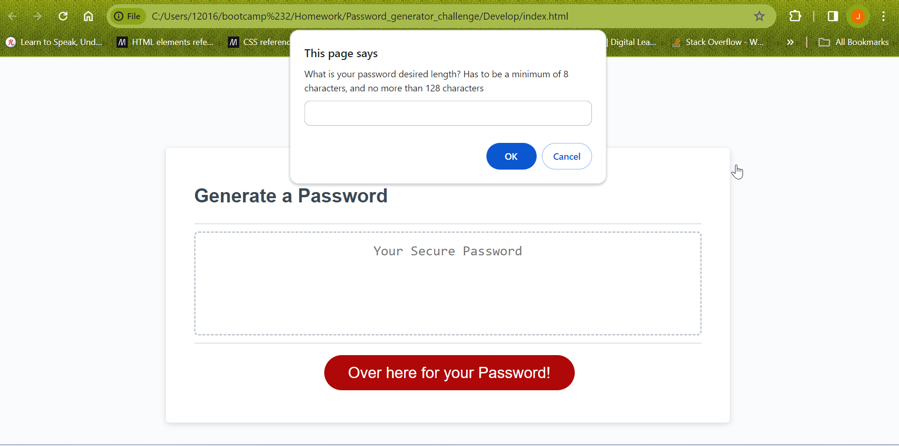
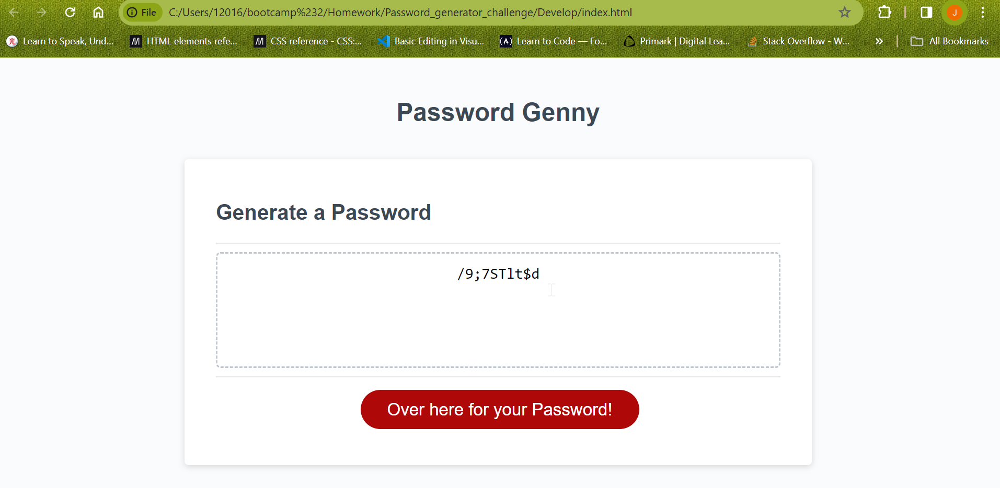

# Password Genny

## Description
Do you ever get stuck trying to come up with a random and strong password? The Password generator or "Genny" will create a random password for you after you choose the criteria's you want the password to contain. This solves the matter of having to think of passwords on your own, and having to make sure its a random one. 

## Installation
N/A

## Usage
To use the generator, you can hit the "Over here for your password" button which will then prompt you to enter how many characters you want your password to have. Then it will ask you a series of questions, asking you to pick whether or not you want to include certain criteria in the password. At least one criteria must be selected and validated in order for a password to generate.

## Link
Here is a link to Genny: 

